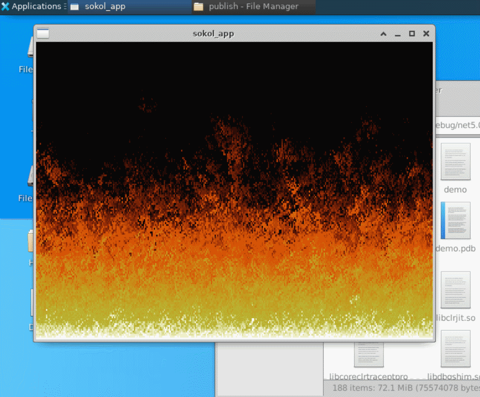

# DOOM fire effect in .NET CIL



Source for a DOOM fire effect written in pure IL. This is inspired by the fire effect written in pure WASM over at https://github.com/binji/raw-wasm/tree/0937c0e3f721ed8ef5e36751cdd69a7d241379bb/doomfire.

The IL will not decompile to C# with ILSpy/DotPeek/dnSpy/JustDecompile because it uses features of the format that can't be mapped to C# - don't bother trying.

The structure of the code is similar to that of the WASM version so that things can be compared side-by-side:

* In particular, the IL version also has no dependencies on the base class library (it doesn't reference mscorlib/System.Runtime/netstandard at all - we only use primitive types). This is not the ".NET Way", and especially the random number generation part could be made more elegant, but this produces results more similar to WASM (that doesn't come with any standard library).
* The IL version only computes the pixels of the frame but doesn't actually display them; the actual drawing happens from the C# program that references the IL program. This is similar to the WASM version where the rendering happens with HTML/JavaScript. I could have written that part in IL too, but there's little point and C# is more readable.

The C# file uses the [Sokol](https://github.com/floooh/sokol) library to do the drawing and windowing. This makes the solution very portable since Sokol runs pretty much on any platform that supports one of OpenGL/GLES/D3D11/D3D12/Metal/Vulkan/WebGPU.

## Building

### OPTIONAL: Building the Sokol library

Pre-built Sokol for Unbuntu and for Windows (both x64) is part of the repo, but if you want to build your own:

```
git clone https://github.com/floooh/sokol.git
git checkout 5fbb6a25501e5478674ca0600a7539033592d749
cd sokol
```

Drop sokol.c into that directory with the following content:

```c
#define SOKOL_IMPL
#define SOKOL_DLL
#define SOKOL_GLCORE33
#define SOKOL_NO_ENTRY

#include "sokol_app.h"
#include "sokol_gfx.h"
#include "util/sokol_gl.h"
#include "sokol_glue.h"
```

On Linux, run this:

```
clang -shared -fPIC -lX11 -lXi -lXcursor sokol.c -o libsokol.so
```

On Windows, run this from a x64 Native Tools Command prompt:

```
cl /EHs-c- /GR- /LD /Zi /GS- /O1 sokol.c /link /opt:ref,icf
```

Copy the generated libsokol.so/sokol.dll into the root of this repo.

### Building and running the fire effect

```
dotnet restore demo.csproj
dotnet run -p demo.csproj
```
